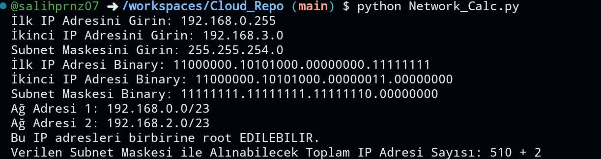
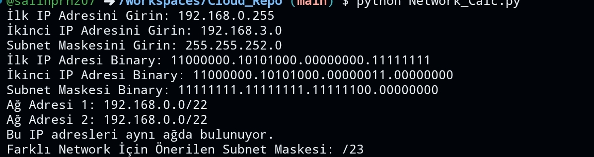

# Network Calculator:

Ikı network eğer birbirine Root edilebilir ise:
<h1 align="center">
  
</h1>

Aksi halde:
<h1 align="center">
  
</h1>

# Kodu Programa(.exe) çevirmek için..

1. **PyInstaller'ı Yükleme**: İlk olarak, PyInstaller'ı yüklemelisiniz. Komut istemcisini açın ve aşağıdaki komutu kullanarak PyInstaller'ı yükleyin:
   
   ```
   pip install pyinstaller
   ```

2. **.exe Dosyasını Oluşturma**: PyInstaller yüklendikten sonra, komut istemcisini açın ve kodunuzun bulunduğu klasöre gidin. Ardından aşağıdaki komutu kullanarak .exe dosyasını oluşturun:

   ```
   pyinstaller --onefile your_script_name.py
   ```

   Burada `your_script_name.py` kısmını, .exe dosyası oluşturmak istediğiniz Python dosyasının adıyla değiştirin.

3. **.exe Dosyasını Bulma**: PyInstaller, komutu çalıştırdığınız dizinde "dist" adında bir klasör oluşturur. Bu klasörde, Python dosyanızın adıyla aynı bir .exe dosyası oluşturulmuş olacak.

Bu adımları takip ederek Python kodu .exe dosyasına dönüştürebilirsiniz.

# Yardımcı Araçlar

Verilen IP ve Subnet Mask adresinin binary gösterimini, Network ve Broadcast kimlik ve alınabilir IP üye sayısını verir.

<h1 align="center">
  
</h1>
